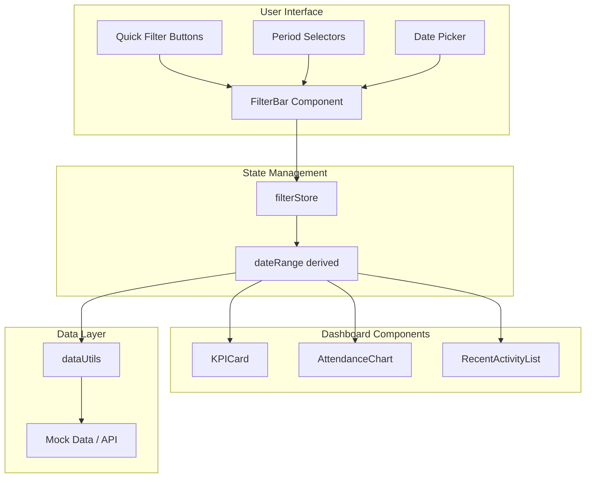

# Global Filtering System - Implementation Plan

## Document Overview

**Created:** December 10, 2025  
**Status:** Ready for Implementation  
**Scope:** Dashboard filtering system for Year, Month, Quarter, and Custom Date Range

---

## 1. Executive Summary

This document outlines the implementation plan for adding a Global Filtering System to the Church Tracker Dashboard. The system will allow users to filter dashboard data by:

- **Quick Filters:** This Year, This Month, Last 30 Days, This Quarter
- **Period Selectors:** Specific Year, Specific Month, Specific Quarter
- **Custom Range:** Date picker for custom start/end dates

### Current State

The dashboard currently uses **static mock data** with no date controls:
- [`KPICard.svelte`](../src/lib/components/dashboard/KPICard.svelte) displays hardcoded values
- [`AttendanceChart.svelte`](../src/lib/components/dashboard/AttendanceChart.svelte) uses default 12-month mock data
- [`+page.svelte`](../src/routes/+page.svelte) contains static `kpiData` array
- No global state management for filters

### Target State

A reactive filtering system where:
- Filter selections update all dashboard components simultaneously
- Filter state persists across page navigation
- URL parameters enable shareable filtered views
- Mobile-responsive filter UI

---

## 2. Architecture Overview

### System Flow Diagram



---

## 3. File Structure

### New Files to Create

```
my-church-tracker/src/lib/
├── stores/
│   └── filterStore.js          # Svelte store for filter state
├── utils/
│   └── dateUtils.js            # Date calculation utilities
├── components/
│   └── filters/
│       ├── FilterBar.svelte    # Main filter bar component
│       ├── QuickFilters.svelte # Quick filter buttons
│       ├── PeriodSelect.svelte # Year/Month/Quarter dropdowns
│       └── DateRangePicker.svelte # Custom date range modal
```

### Files to Modify

```
my-church-tracker/src/
├── lib/components/
│   ├── layout/
│   │   └── DashboardLayout.svelte  # Add FilterBar integration point
│   ├── dashboard/
│   │   ├── KPICard.svelte          # Add filter reactivity
│   │   └── AttendanceChart.svelte  # Add filter reactivity
│   └── shared/
│       └── PageHeader.svelte       # Optional: Add filter indicator
├── routes/
│   └── +page.svelte                # Connect to filter store
```

---

## 4. TypeScript Interfaces

### Filter State Types

```typescript
// src/lib/types/filters.ts

/**
 * Filter type enumeration
 */
export type FilterType = 
  | 'thisYear'
  | 'thisMonth'
  | 'last30Days'
  | 'thisQuarter'
  | 'specificYear'
  | 'specificMonth'
  | 'specificQuarter'
  | 'customRange';

/**
 * Quarter identifier
 */
export type Quarter = 'Q1' | 'Q2' | 'Q3' | 'Q4';

/**
 * Main filter state interface
 */
export interface FilterState {
  /** Currently active filter type */
  type: FilterType;
  
  /** Selected year (e.g., 2025) */
  year: number | null;
  
  /** Selected month (0-11, January = 0) */
  month: number | null;
  
  /** Selected quarter */
  quarter: Quarter | null;
  
  /** Custom date range start (ISO string) */
  customStart: string | null;
  
  /** Custom date range end (ISO string) */
  customEnd: string | null;
}

/**
 * Computed date range from filter state
 */
export interface DateRange {
  /** Start date (ISO string YYYY-MM-DD) */
  startDate: string;
  
  /** End date (ISO string YYYY-MM-DD) */
  endDate: string;
  
  /** Human-readable label for display */
  label: string;
}

/**
 * Filter option for dropdowns
 */
export interface FilterOption {
  value: string | number;
  label: string;
  disabled?: boolean;
}

/**
 * Quick filter button configuration
 */
export interface QuickFilterConfig {
  type: FilterType;
  label: string;
  icon?: string;
}
```

### Data Types

```typescript
// src/lib/types/data.ts

/**
 * KPI data structure with date awareness
 */
export interface KPIData {
  title: string;
  value: number;
  trend?: {
    value: number;
    direction: 'up' | 'down' | 'neutral';
  };
  format: 'number' | 'percentage' | 'currency';
  /** Date this metric was recorded */
  date?: string;
}

/**
 * Attendance data point
 */
export interface AttendanceDataPoint {
  month: string;
  attendance: number;
  /** Full date for filtering */
  date: string;
}

/**
 * Activity item with date
 */
export interface ActivityItem {
  id: string;
  type: string;
  description: string;
  timestamp: string;
  actor?: string;
}
```

---

## 5. Store Structure

### Filter Store Implementation

```javascript
// src/lib/stores/filterStore.js

import { writable, derived } from 'svelte/store';
import { getDateRange } from '$lib/utils/dateUtils';

/**
 * Default filter state - defaults to "This Year"
 */
const defaultFilterState = {
  type: 'thisYear',
  year: new Date().getFullYear(),
  month: null,
  quarter: null,
  customStart: null,
  customEnd: null
};

/**
 * Main filter store
 */
function createFilterStore() {
  const { subscribe, set, update } = writable(defaultFilterState);
  
  return {
    subscribe,
    
    /**
     * Set filter to "This Year"
     */
    setThisYear: () => update(state => ({
      ...state,
      type: 'thisYear',
      year: new Date().getFullYear(),
      month: null,
      quarter: null,
      customStart: null,
      customEnd: null
    })),
    
    /**
     * Set filter to "This Month"
     */
    setThisMonth: () => update(state => ({
      ...state,
      type: 'thisMonth',
      year: new Date().getFullYear(),
      month: new Date().getMonth(),
      quarter: null,
      customStart: null,
      customEnd: null
    })),
    
    /**
     * Set filter to "Last 30 Days"
     */
    setLast30Days: () => update(state => ({
      ...state,
      type: 'last30Days',
      year: null,
      month: null,
      quarter: null,
      customStart: null,
      customEnd: null
    })),
    
    /**
     * Set filter to "This Quarter"
     */
    setThisQuarter: () => {
      const now = new Date();
      const currentQuarter = `Q${Math.floor(now.getMonth() / 3) + 1}`;
      update(state => ({
        ...state,
        type: 'thisQuarter',
        year: now.getFullYear(),
        month: null,
        quarter: currentQuarter,
        customStart: null,
        customEnd: null
      }));
    },
    
    /**
     * Set filter to specific year
     */
    setYear: (year) => update(state => ({
      ...state,
      type: 'specificYear',
      year,
      month: null,
      quarter: null,
      customStart: null,
      customEnd: null
    })),
    
    /**
     * Set filter to specific month and year
     */
    setMonth: (year, month) => update(state => ({
      ...state,
      type: 'specificMonth',
      year,
      month,
      quarter: null,
      customStart: null,
      customEnd: null
    })),
    
    /**
     * Set filter to specific quarter
     */
    setQuarter: (year, quarter) => update(state => ({
      ...state,
      type: 'specificQuarter',
      year,
      month: null,
      quarter,
      customStart: null,
      customEnd: null
    })),
    
    /**
     * Set custom date range
     */
    setCustomRange: (startDate, endDate) => update(state => ({
      ...state,
      type: 'customRange',
      year: null,
      month: null,
      quarter: null,
      customStart: startDate,
      customEnd: endDate
    })),
    
    /**
     * Reset to default (This Year)
     */
    reset: () => set(defaultFilterState)
  };
}

export const filterStore = createFilterStore();

/**
 * Derived store that computes the actual date range
 */
export const dateRange = derived(filterStore, ($filter) => {
  return getDateRange($filter);
});
```

---

## 6. Date Utilities

### Date Calculation Functions

```javascript
// src/lib/utils/dateUtils.js

/**
 * Month names for display
 */
export const MONTH_NAMES = [
  'January', 'February', 'March', 'April',
  'May', 'June', 'July', 'August',
  'September', 'October', 'November', 'December'
];

/**
 * Short month names
 */
export const MONTH_NAMES_SHORT = [
  'Jan', 'Feb', 'Mar', 'Apr', 'May', 'Jun',
  'Jul', 'Aug', 'Sep', 'Oct', 'Nov', 'Dec'
];

/**
 * Quarter definitions
 */
export const QUARTERS = {
  Q1: { start: 0, end: 2, label: 'Q1 (Jan-Mar)' },
  Q2: { start: 3, end: 5, label: 'Q2 (Apr-Jun)' },
  Q3: { start: 6, end: 8, label: 'Q3 (Jul-Sep)' },
  Q4: { start: 9, end: 11, label: 'Q4 (Oct-Dec)' }
};

/**
 * Format date as ISO string (YYYY-MM-DD)
 */
export function formatDateISO(date) {
  return date.toISOString().split('T')[0];
}

/**
 * Format date range for display
 */
export function formatDateRangeLabel(startDate, endDate) {
  const start = new Date(startDate);
  const end = new Date(endDate);
  
  const startStr = `${MONTH_NAMES_SHORT[start.getMonth()]} ${start.getDate()}`;
  const endStr = `${MONTH_NAMES_SHORT[end.getMonth()]} ${end.getDate()}, ${end.getFullYear()}`;
  
  return `${startStr} - ${endStr}`;
}

/**
 * Calculate date range based on filter state
 * @param {FilterState} filter - Current filter state
 * @returns {DateRange} Computed date range with label
 */
export function getDateRange(filter) {
  const today = new Date();
  let startDate, endDate, label;
  
  switch (filter.type) {
    case 'thisYear': {
      const year = today.getFullYear();
      startDate = new Date(year, 0, 1);
      endDate = new Date(year, 11, 31);
      label = `This Year (${year})`;
      break;
    }
    
    case 'thisMonth': {
      startDate = new Date(today.getFullYear(), today.getMonth(), 1);
      endDate = new Date(today.getFullYear(), today.getMonth() + 1, 0);
      label = `This Month (${MONTH_NAMES[today.getMonth()]} ${today.getFullYear()})`;
      break;
    }
    
    case 'last30Days': {
      endDate = new Date(today);
      startDate = new Date(today);
      startDate.setDate(startDate.getDate() - 30);
      label = 'Last 30 Days';
      break;
    }
    
    case 'thisQuarter': {
      const quarterIndex = Math.floor(today.getMonth() / 3);
      const quarterKey = `Q${quarterIndex + 1}`;
      const quarter = QUARTERS[quarterKey];
      startDate = new Date(today.getFullYear(), quarter.start, 1);
      endDate = new Date(today.getFullYear(), quarter.end + 1, 0);
      label = `This Quarter (${quarterKey} ${today.getFullYear()})`;
      break;
    }
    
    case 'specificYear': {
      startDate = new Date(filter.year, 0, 1);
      endDate = new Date(filter.year, 11, 31);
      label = `Year ${filter.year}`;
      break;
    }
    
    case 'specificMonth': {
      startDate = new Date(filter.year, filter.month, 1);
      endDate = new Date(filter.year, filter.month + 1, 0);
      label = `${MONTH_NAMES[filter.month]} ${filter.year}`;
      break;
    }
    
    case 'specificQuarter': {
      const quarter = QUARTERS[filter.quarter];
      startDate = new Date(filter.year, quarter.start, 1);
      endDate = new Date(filter.year, quarter.end + 1, 0);
      label = `${filter.quarter} ${filter.year}`;
      break;
    }
    
    case 'customRange': {
      startDate = new Date(filter.customStart);
      endDate = new Date(filter.customEnd);
      label = formatDateRangeLabel(filter.customStart, filter.customEnd);
      break;
    }
    
    default: {
      // Fallback to this year
      const year = today.getFullYear();
      startDate = new Date(year, 0, 1);
      endDate = new Date(year, 11, 31);
      label = `This Year (${year})`;
    }
  }
  
  return {
    startDate: formatDateISO(startDate),
    endDate: formatDateISO(endDate),
    label
  };
}

/**
 * Generate array of available years (current year back to 2020)
 */
export function getAvailableYears() {
  const currentYear = new Date().getFullYear();
  const years = [];
  for (let year = currentYear; year >= 2020; year--) {
    years.push(year);
  }
  return years;
}

/**
 * Get current quarter
 */
export function getCurrentQuarter() {
  const month = new Date().getMonth();
  return `Q${Math.floor(month / 3) + 1}`;
}

/**
 * Check if a date falls within a range
 */
export function isDateInRange(date, startDate, endDate) {
  const d = new Date(date);
  const start = new Date(startDate);
  const end = new Date(endDate);
  return d >= start && d <= end;
}
```

---

## 7. Component Specifications

### 7.1 FilterBar Component

**File:** `src/lib/components/filters/FilterBar.svelte`

**Purpose:** Main container for all filter controls, positioned at the top of the dashboard.

**Props:**
- `showQuickFilters` (boolean, default: true) - Show/hide quick filter buttons
- `showPeriodSelectors` (boolean, default: true) - Show/hide dropdowns
- `showDatePicker` (boolean, default: true) - Show/hide custom date picker
- `sticky` (boolean, default: true) - Sticky positioning on scroll

**Layout Structure:**
```
┌─────────────────────────────────────────────────────────────────┐
│ FilterBar                                                        │
├─────────────────────────────────────────────────────────────────┤
│ ┌─────────────────────────────────────────────────────────────┐ │
│ │ QuickFilters                                                 │ │
│ │ [This Year] [This Month] [Last 30 Days] [This Quarter]      │ │
│ └─────────────────────────────────────────────────────────────┘ │
│ ┌─────────────────────────────────────────────────────────────┐ │
│ │ PeriodSelectors                                              │ │
│ │ [Year ▼] [Month ▼] [Quarter ▼]                              │ │
│ └─────────────────────────────────────────────────────────────┘ │
│ ┌─────────────────────────────────────────────────────────────┐ │
│ │ Actions                                                      │ │
│ │ [📅 Custom Range] [Clear Filters]                           │ │
│ └─────────────────────────────────────────────────────────────┘ │
│ ┌─────────────────────────────────────────────────────────────┐ │
│ │ Selected: This Year (January 1 - December 31, 2025)         │ │
│ └─────────────────────────────────────────────────────────────┘ │
└─────────────────────────────────────────────────────────────────┘
```

**Styling:**
- Background: `#1a202c` (matches dashboard theme)
- Border bottom: `1px solid #2d3748`
- Padding: `16px`
- Sticky positioning with `z-index: 10`

**Mobile Behavior:**
- Collapses into a drawer/modal on screens < 768px
- Shows filter icon with badge indicating active filters
- Full-screen filter panel when expanded

---

### 7.2 QuickFilters Component

**File:** `src/lib/components/filters/QuickFilters.svelte`

**Purpose:** Row of quick-access filter buttons for common time periods.

**Buttons:**
1. **This Year** - Current calendar year (Jan 1 - Dec 31)
2. **This Month** - Current month (1st - last day)
3. **Last 30 Days** - Rolling 30-day window
4. **This Quarter** - Current quarter (Q1/Q2/Q3/Q4)

**Button States:**
- **Inactive:** `bg-gray-700 text-gray-400 border-gray-600`
- **Hover:** `bg-gray-600 border-gray-500`
- **Active:** `bg-cyan-500 text-white border-cyan-400`

**Accessibility:**
- `role="group"` with `aria-label="Quick time filters"`
- Each button has `aria-pressed` state
- Keyboard navigation with Tab and Enter/Space

---

### 7.3 PeriodSelect Component

**File:** `src/lib/components/filters/PeriodSelect.svelte`

**Purpose:** Dropdown selectors for specific year, month, and quarter.

**Dropdowns:**
1. **Year Selector**
   - Options: 2025, 2024, 2023, 2022, 2021, 2020
   - Default placeholder: "Select Year..."

2. **Month Selector**
   - Options: January through December
   - Shows year context when selected
   - Default placeholder: "Select Month..."

3. **Quarter Selector**
   - Options: Q1 (Jan-Mar), Q2 (Apr-Jun), Q3 (Jul-Sep), Q4 (Oct-Dec)
   - Default placeholder: "Select Quarter..."

**Interaction Logic:**
- Selecting a year clears month and quarter selections
- Selecting a month auto-sets the year if not already set
- Selecting a quarter auto-sets the year if not already set
- Dropdowns are mutually exclusive (selecting one clears others)

---

### 7.4 DateRangePicker Component

**File:** `src/lib/components/filters/DateRangePicker.svelte`

**Purpose:** Modal dialog for selecting custom date ranges.

**Features:**
- Two date inputs (Start Date, End Date)
- Calendar widget for visual selection
- Validation (end date must be after start date)
- Quick presets (Last 7 days, Last 90 days, etc.)

**Modal Structure:**
```
┌─────────────────────────────────────┐
│ Custom Date Range              [X]  │
├─────────────────────────────────────┤
│ Start Date: [____/____/____]        │
│ End Date:   [____/____/____]        │
│                                     │
│ Quick Presets:                      │
│ [Last 7 Days] [Last 90 Days]        │
│ [Last 6 Months] [Last Year]         │
│                                     │
│ [Cancel]              [Apply Range] │
└─────────────────────────────────────┘
```

---

## 8. Integration Points

### 8.1 DashboardLayout Integration

**Modification to:** [`DashboardLayout.svelte`](../src/lib/components/layout/DashboardLayout.svelte)

Add a slot or direct integration for FilterBar above the main content area:

```svelte
<div class="flex min-h-screen w-full flex-col">
  <!-- NEW: Filter Bar Integration -->
  <slot name="filters" />
  
  <div class="flex-1 overflow-y-auto p-4 scrollbar-thin md:p-6 lg:p-8">
    <div class="mx-auto w-full max-w-7xl space-y-6 md:space-y-8">
      <slot />
    </div>
  </div>
</div>
```

### 8.2 KPICard Integration

**Modification to:** [`KPICard.svelte`](../src/lib/components/dashboard/KPICard.svelte)

The component already accepts props for `value` and `trend`. No structural changes needed - the parent component will pass filtered data.

**Parent responsibility:** Subscribe to `dateRange` store and filter KPI data before passing to component.

### 8.3 AttendanceChart Integration

**Modification to:** [`AttendanceChart.svelte`](../src/lib/components/dashboard/AttendanceChart.svelte)

Add filter awareness:

```svelte
<script>
  import { dateRange } from '$lib/stores/filterStore';
  import { isDateInRange } from '$lib/utils/dateUtils';
  
  export let data = defaultData;
  
  // Filter data based on current date range
  $: filteredData = data.filter(item => 
    isDateInRange(item.date, $dateRange.startDate, $dateRange.endDate)
  );
  
  // Use filteredData instead of data for calculations
  $: maxAttendance = Math.max(...filteredData.map(d => d.attendance)) * 1.1;
  // ... rest of calculations
</script>
```

### 8.4 Main Page Integration

**Modification to:** [`+page.svelte`](../src/routes/+page.svelte)

```svelte
<script>
  import { filterStore, dateRange } from '$lib/stores/filterStore';
  import FilterBar from '$lib/components/filters/FilterBar.svelte';
  // ... other imports
  
  // Subscribe to date range for filtering
  $: currentRange = $dateRange;
  
  // Filter KPI data based on date range
  $: filteredKpiData = filterKpiDataByRange(kpiData, currentRange);
</script>

<DashboardLayout>
  <FilterBar slot="filters" />
  
  <PageHeader title="Dashboard">
    <span slot="subtitle" class="text-sm text-muted-foreground">
      {currentRange.label}
    </span>
  </PageHeader>
  
  <!-- Rest of dashboard with filtered data -->
</DashboardLayout>
```

---

## 9. Implementation Phases

### Phase 1: Foundation (Day 1-2)

1. Create `src/lib/stores/filterStore.js`
2. Create `src/lib/utils/dateUtils.js`
3. Create TypeScript type definitions (optional but recommended)
4. Write unit tests for date utilities

**Deliverables:**
- Working filter store with all methods
- Date calculation utilities
- Test coverage for date functions

### Phase 2: Filter Components (Day 3-4)

1. Create `FilterBar.svelte` container
2. Create `QuickFilters.svelte` with button group
3. Create `PeriodSelect.svelte` with dropdowns
4. Style all components to match design system

**Deliverables:**
- Functional filter bar component
- All filter types working
- Responsive layout (desktop)

### Phase 3: Dashboard Integration (Day 5)

1. Modify `DashboardLayout.svelte` to include filter slot
2. Update `+page.svelte` to use filter store
3. Connect KPICard to filtered data
4. Connect AttendanceChart to filtered data

**Deliverables:**
- Filters affecting dashboard data
- Real-time updates on filter change
- Loading states during data refresh

### Phase 4: Advanced Features (Day 6-7)

1. Create `DateRangePicker.svelte` modal
2. Add URL parameter persistence
3. Add localStorage persistence
4. Implement mobile responsive design

**Deliverables:**
- Custom date range picker
- Shareable filter URLs
- Filter persistence across sessions
- Mobile-friendly filter drawer

### Phase 5: Polish & Testing (Day 8)

1. Accessibility audit and fixes
2. Cross-browser testing
3. Performance optimization
4. Documentation updates

**Deliverables:**
- WCAG AA compliant
- Works in Chrome, Firefox, Safari, Edge
- Smooth animations and transitions
- Updated component documentation

---

## 10. Testing Strategy

### Unit Tests

```javascript
// dateUtils.test.js
describe('getDateRange', () => {
  test('thisYear returns Jan 1 to Dec 31 of current year', () => {
    const result = getDateRange({ type: 'thisYear' });
    expect(result.startDate).toBe('2025-01-01');
    expect(result.endDate).toBe('2025-12-31');
  });
  
  test('specificMonth returns correct range', () => {
    const result = getDateRange({ 
      type: 'specificMonth', 
      year: 2024, 
      month: 9 // October
    });
    expect(result.startDate).toBe('2024-10-01');
    expect(result.endDate).toBe('2024-10-31');
  });
  
  test('quarter Q3 returns Jul-Sep', () => {
    const result = getDateRange({
      type: 'specificQuarter',
      year: 2025,
      quarter: 'Q3'
    });
    expect(result.startDate).toBe('2025-07-01');
    expect(result.endDate).toBe('2025-09-30');
  });
});
```

### Integration Tests

- Filter button click updates store
- Store change triggers component re-render
- URL parameters sync with filter state
- Mobile drawer opens/closes correctly

### E2E Tests

- User can filter by "This Month" and see updated data
- User can select specific year and month combination
- User can share filtered URL and recipient sees same view
- Mobile user can access and use filter drawer

---

## 11. Accessibility Requirements

### Keyboard Navigation

- Tab through all filter controls
- Enter/Space to activate buttons
- Arrow keys to navigate dropdowns
- Escape to close modals/dropdowns

### Screen Reader Support

- `aria-label` on filter groups
- `aria-pressed` on toggle buttons
- `aria-expanded` on dropdowns
- `aria-live` region for filter change announcements

### Visual Accessibility

- Minimum 4.5:1 contrast ratio for text
- Focus indicators visible (2px cyan ring)
- No reliance on color alone for state indication
- Reduced motion support

---

## 12. Performance Considerations

### Optimization Strategies

1. **Debounce filter changes** - Wait 150ms before triggering data refresh
2. **Memoize calculations** - Cache filtered data when inputs unchanged
3. **Lazy load DateRangePicker** - Only load modal component when needed
4. **Virtual scrolling** - For long dropdown lists (if needed)

### Bundle Size

- Keep filter components lightweight
- Use native HTML date inputs where possible
- Avoid heavy date libraries (use native Date API)

---

## 13. Future Enhancements

### Phase 2 Features (Not in Initial Scope)

1. **Comparison Mode** - Compare two time periods side-by-side
2. **Saved Filters** - Save and name custom filter presets
3. **Filter Templates** - Pre-defined filters for common reports
4. **Export with Filters** - Export data respecting current filters

### API Integration

When backend is ready:
- Replace mock data with API calls
- Add query parameters for date range
- Implement caching strategy
- Add error handling for failed requests

---

## 14. Dependencies

### Required (Already in Project)

- Svelte 5 (runes syntax)
- Tailwind CSS
- SvelteKit

### Optional Additions

- None required for basic implementation
- Consider `date-fns` if complex date manipulation needed later

---

## 15. Success Criteria

### Functional Requirements

- [ ] All quick filter buttons work correctly
- [ ] Year/Month/Quarter dropdowns function properly
- [ ] Custom date range picker validates input
- [ ] Filters update all dashboard components
- [ ] Filter state persists on page refresh
- [ ] URL parameters enable shareable views

### Non-Functional Requirements

- [ ] Filter change response time < 200ms
- [ ] Mobile layout works on 320px+ screens
- [ ] WCAG AA accessibility compliance
- [ ] No console errors or warnings
- [ ] Works in all major browsers

---

## 16. Appendix

### A. Color Reference

| Element | Inactive | Hover | Active |
|---------|----------|-------|--------|
| Button BG | `#2d3748` | `#374151` | `#06b6d4` |
| Button Text | `#a0aec0` | `#e2e8f0` | `#ffffff` |
| Button Border | `#4a5568` | `#4a5568` | `#0891b2` |
| Dropdown BG | `#1a202c` | `#262626` | `#06b6d4` |

### B. Breakpoints

| Name | Width | Behavior |
|------|-------|----------|
| Mobile | < 640px | Filter drawer |
| Tablet | 640-1023px | Compact bar |
| Desktop | ≥ 1024px | Full bar |

### C. Related Documents

- [FILTERING-QUICK-REFERENCE.md](./part%201.3%20FILTERING-QUICK-REFERENCE.md)
- [filter-visual-guide.md](./part%202.4%20filter-visual-guide.md)
- [filters-integration-guide.md](./Part%202.4%20filters-integration-guide.md)

---

**Document Version:** 1.0  
**Last Updated:** December 10, 2025  
**Author:** Kilo Code Architect Mode  
**Status:** Ready for Implementation Review